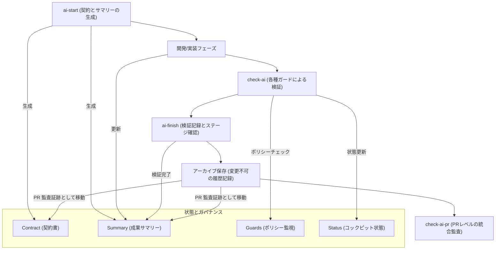

# アーキテクチャ (Architecture)

## コンポーネントの依存関係とプロセスフロー

AI Cockpitフレームワーク内における、タスクの開始からPRの検証にいたるまでのライフサイクルとデータ/コントロールのフローは以下の通りです。




```text
.ai/
  cockpit/
    README.md
    checks.yaml
    current_status.md
  guards/
    agent_risk_policy.yaml
    ai_review_policy.yaml
    backtrack_policy.yaml
    cockpit_status_policy.yaml
    coverage_policy.yaml
    file_boundary.yaml
    file_ownership.yaml
    scope_policy.yaml
    summary_policy.yaml
  work-items/
    _templates/
      work_item_contract.example.json
      work_item_summary.example.json
    active/
    archive/
.cursor/
  rules/
    ai-cockpit.mdc
examples/
  csharp/
  flutter/
  go/
  java/
  kotlin/
  php/
  python/
  ruby/
  rust/
  swift/
  typescript/
docs/
  assets/
    ai-cockpit-demo.gif
scripts/
  ai_archive_work_item.py
  ai_check_agent_risk.py
  ai_check_backtrack.py
  ai_check_coverage_guard.py
  ai_check_guards.py
  ai_check_review_policy.py
  ai_check_scope.py
  ai_check_status.py
  ai_check_status_consistency.py
  ai_check_summary.py
  ai_check_work_item.py
  ai_checkpoint.py
  ai_common.py
  ai_finish.py
  ai_generate_status.py
  ai_observability.py
  ai_start.py
  install_ai_cockpit.py
target/
  ai_observability.jsonl
  ai_*.json
templates/
  make/
    Makefile.ai
  stacks/
    *.mk
install.sh
Makefile
AGENTS.md
CLAUDE.md
GEMINI.md
```

## コアコンポーネント (Core Components)

| コンポーネント | 目的・役割 |
| --- | --- |
| Work Item Contract | タスクのスコープ、参照ソース、受け入れ基準、検証項目、およびロールバック手順を宣言します。 |
| Scope Guard | 実際の Git 差分が `scope` 内に収まり、`outOfScope` に抵触していないかをチェックします。 |
| Backtrack Guard | 保護されたテスト、スナップショット、またはワークアイテム証跡の削除を検出し、設定済みゲートの通過を防ぎます。 |
| Coverage Guard | 対応するテストコードの変更を伴わないプロダクションコード変更を検出し、設定済みゲートの通過を防ぎます。 |
| Agent Risk Guard | 必須ゲートの欠落、作業途中のスコープ逸脱、未解決事項を残した完了申告を検出するチェックゲートです。プロンプトインジェクションを検出または防止する機能ではありません。 |
| AI Review Policy | ガバナンスや CI 関連ファイルの変更など、レビュー時に特に注視すべき変更をフラグ立てするレポート機能です。 |
| Checkpoint | 開発中の整合性スナップショットであり、スコープ、受け入れ、および検証状態のドリフトを検出します。 |
| Status Consistency Guard | `current_status.md` が現在のアクティブなワークアイテムと一致しているかを検証します。 |
| Change Summary | 変更されたファイル、合格した検証、リスク評価、生成ファイル、および破壊的変更の履歴を記録します。 |
| Cockpit Status | アクティブな AI タスクの現在の状態を統合表示するステータス画面を生成します。 |
| Observability | 各チェックの実行ごとに構造化された JSONL イベントを `target/ai_observability.jsonl` に追記します。 |
| Finish Flow | 必須の検証チェックを実行し、合格した場合にワークアイテムをアーカイブします。 |

## 差分と検証証跡のセマンティクス (Diff and Evidence Semantics)

ワークアイテムの基準点（ベースライン）は、タスク開始時に取得される Git コミットです。有効な変更セットは、`baseCommit...HEAD` 間の差分、`HEAD` に対するステージング/未ステージングの変更、および未追跡ファイル（untracked files）の論理和として定義されます。開始時点で dirty であったパスは、そのファイルのハッシュ値（fingerprint）が変化しない限り、スコープチェック対象から除外されます。CI 環境においては、`AI_BASE_COMMIT` 環境変数を設定することで、プルリクエストのマージベース（merge-base）をベースラインとして上書きできます。

検証コマンドは Contract に自由記述せず、`.ai/cockpit/checks.yaml` のレジストリで管理します。v2 Contract はチェック ID を指定し、各 ID は明示的な Make ターゲットへ解決されます。

Finish フローは、チェック ID、実行コミット、Contract ハッシュ、正規化したコマンドハッシュを検証メタデータとして記録します。これらは Summary と現在の Contract・コマンド記録の不一致を検出するための整合性情報です。悪意ある書き換えに対する暗号学的証明や、信頼できる本人性の保証ではありません。

PR 監査（`check-ai-pr`）は、プルリクエストに含まれるアーカイブ済み Contract、Summary、レビュー記録を走査します。新しい証跡は Contract と Summary の組として同時に追加する必要があります。既存証跡の修正、削除、名前変更は PR ポリシーで拒否されるため、通常のレビュー経路では追加式の監査記録として扱われます。ただし、ファイルシステムの読み取り専用属性や外部の不変ストレージを提供するものではありません。

監査対象となる各変更パスは、いずれかのアーカイブ済み Work Item の `scope` に含まれ、かつ同じ Summary の `changedFiles` に記録される必要があります。PR 監査では、開始時の dirty ファイル除外ロジックを無効化し、完全な PR 差分を検証します。

PR のアーカイブ検証には必ず Contract v2 形式を使用する必要があります。v1 形式はローカルの歴史的調査のためにのみ読み込み可能として許容されますが、PR で新規追加または変更された場合は、検証レジストリや実行メタデータの迂回を防ぐために拒否されます。

リポジトリ内の承認フィールド（`approvedBy` 等）は、ワークフロー上の意思決定プロセスを記録するものであり、厳密な人間の個人認証を提供するものではありません。AI Cockpit は AI エージェントの自律的な安全ガードを目的とした変更管理ワークフローであり、悪意のあるエージェントを隔離するセキュリティサンドボックスではありません。信頼された人間による最終承認や独立したビルドテストの実行は、コードホスティングプラットフォームの保護されたブランチ設定や保護された CI 環境で実施される必要があります。
