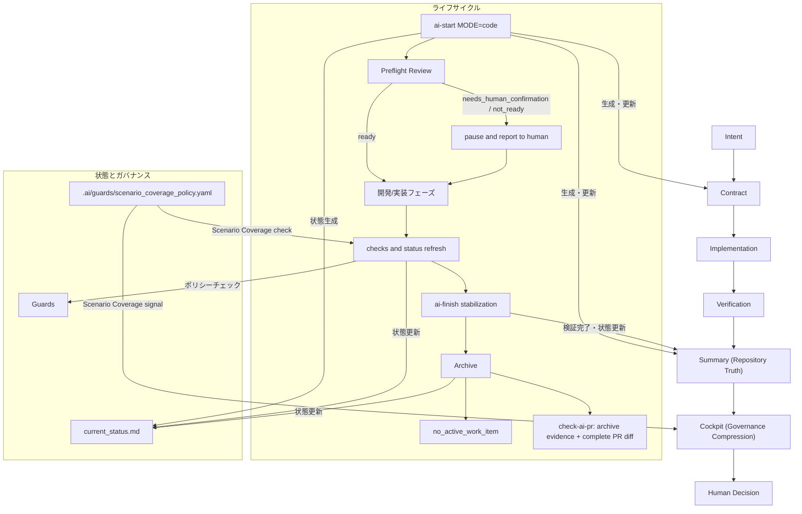

# アーキテクチャ (Architecture)

AI Cockpit のアーキテクチャは、AI Change Governance を単独のチェック群としてではなく、人間とエージェントが同じ証拠面で協働するための環境として構成されています。ガバナンスが制御の中心にあり、Intent、Contract、Implementation、Verification、Summary、Cockpit、Human Decision が delegation、description、discernment、diligence を実体化します。

## コンポーネントの依存関係とプロセスフロー

AI Cockpit フレームワーク内における、タスクの開始から PR の検証にいたるまでのライフサイクルとデータ/コントロールのフローは以下の通りです。




以下のツリーは、追跡対象の主要な実行時・ガバナンス構成要素を網羅する管理対象一覧であり、単なる例示ではありません。

```text
.ai/                                   # AI Cockpit の管理ディレクトリ
  cockpit/
    README.md                          # Cockpit の概要・利用方法
    README.ja.md                       # Cockpit の日本語実行時ガイド
    adoption.md                        # 導入・採用ガイド
    adoption.ja.md                     # 導入・採用ガイド（日本語）
    checks.yaml                        # Cockpit のチェック設定
    current_status.md                  # 現在のガバナンス状態（人向けサマリー）
    system_invariants.json             # 配布・CI・文書の不変条件
    version.json                       # Cockpit バージョン情報
  guards/                              # ガードポリシー定義
    agent_risk_policy.yaml             # AI 実装リスク判定ポリシー
    ai_review_policy.yaml              # AI レビュー判定ポリシー
    backtrack_policy.yaml              # 巻き戻し（Backtrack）防止ポリシー
    cockpit_status_policy.yaml         # Cockpit ステータス判定ポリシー
    coverage_policy.yaml               # カバレッジ検証ポリシー
    file_boundary.yaml                 # 編集可能ファイル境界ポリシー
    file_ownership.yaml                # ファイル責任範囲ポリシー
    preflight_review_policy.yaml       # Preflight ゲートポリシー
    scenario_coverage_policy.yaml      # Scenario Coverage 判定ポリシー
    scope_policy.yaml                  # Work Item のスコープ制御ポリシー
    summary_policy.yaml                # Summary 生成・検証ポリシー
  work-items/                          # Work Item 管理
    _templates/
      work_item_contract.example.json  # Contract テンプレート
      work_item_summary.example.json   # Summary テンプレート
    active/                            # 作業中の Work Item
    archive/                           # 完了済み Work Item
  project_profile.yaml                 # 確認済みプロジェクト境界
  glossary.md                          # リポジトリ内用語集
  README.md                            # AI ガバナンス作業領域の入口

.cursor/
  rules/
    ai-cockpit.mdc                     # Cursor 用 AI Cockpit ルール

examples/                              # 各言語向け導入サンプル
  csharp/
  flutter/
  go/
  java/
  kotlin/
  php/
  python/
  ruby/
  rust/
  swift/
  typescript/

docs/
  assets/
    ai-cockpit-demo.gif                # デモ・ドキュメント用画像

scripts/                               # AI Cockpit のコアスクリプト
  ai_archive_work_item.py              # Work Item のアーカイブ
  ai_check_agent_risk.py               # AI 実装リスクチェック
  ai_check_backtrack.py                # Backtrack チェック
  ai_check_coverage_guard.py           # カバレッジガード検証
  ai_check_guards.py                   # ガード統合チェック
  ai_check_review_policy.py            # レビューポリシー検証
  ai_check_scope.py                    # スコープ検証
  ai_check_status.py                   # ステータス検証
  ai_check_status_consistency.py       # ステータス整合性検証
  ai_check_summary.py                  # Summary 検証
  ai_check_work_item.py                # Work Item 検証
  ai_checkpoint.py                     # チェックポイント記録
  ai_common.py                         # 共通ライブラリ
  ai_governance_compression.py         # Governance Compression 生成
  ai_finish.py                         # Work Item 完了処理
  ai_generate_status.py                # Cockpit ステータス生成
  ai_observability.py                  # 実行ログ・監査情報出力
  ai_start.py                          # Work Item 開始処理
  install_ai_cockpit.py                # AI Cockpit インストーラー
  ai_acceptance_policy.py              # Acceptance シグナルポリシー
  ai_calibrate.py                      # Project Profile の校正
  ai_check_adoption_ready.py           # 採用済みプロジェクトの準備検証
  ai_check_guard_calibration.py        # Profile/Guard 校正検証
  ai_check_guidelines.py               # ガイドライン準拠検証
  ai_check_pr.py                       # 完全 PR 差分のアーカイブ所有権監査
  ai_check_scenario_coverage.py        # Scenario Coverage 検証
  ai_doctor.py                         # ローカルガバナンス診断
  ai_intent_policy.py                  # Intent Alignment シグナルポリシー
  ai_onboard.py                        # インストール後オンボーディング
  ai_preflight_review.py               # 実装前 readiness review
  ai_project_doctor.py                 # プロジェクト事実の検出
  ai_project_profile.py                # Project Profile 検証
  ai_readiness_policy.py               # 明示的 Preflight blocker ポリシー
  ai_review_readiness_policy.py        # レビュー準備状態シグナルポリシー
  ai_risk_policy.py                    # 残存リスク シグナルポリシー
  ai_scenario_policy.py                # Scenario Coverage ポリシーヘルパー
  ai_verification_policy.py            # Verification シグナルポリシー
  check_critical_coverage.py           # ファイル単位カバレッジ下限
  check_docs_metadata.py               # 文書メタデータ検証
  check_release_distribution.py        # 公開配布契約検証
  check_system_invariants.py           # 横断的不変条件検証

target/                                # 実行時生成ファイル（監査・ログ）
  ai_observability.jsonl               # Observability ログ
  ai_*.json                            # 実行結果・中間生成ファイル

templates/                             # テンプレート群
  agents/                               # Managed agent rule sections
  glossary.md                           # 導入先プロジェクト用語集テンプレート
  make/
    Makefile.ai                        # 共通 Make タスク
  stacks/
    *.mk                               # スタック別 Make 設定

install.sh                             # インストールエントリーポイント
Makefile                               # プロジェクト共通タスク
release.json                           # Release/public-distribution metadata
requirements-dev.lock                   # Locked development quality dependencies

.github/workflows/                     # push/PR 用 CI
  smoke.yml                            # テンプレート smoke CI
  compatibility.yml                    # 実スタック互換性 CI
tests/                                 # 単体・ライフサイクル・インストーラー・配布の回帰テスト

AGENTS.md                              # AI Agent 向けガイド
CLAUDE.md                              # Claude 向けガイド
GEMINI.md                              # Gemini 向けガイド
```

## コアコンポーネント (Core Components)

| コンポーネント | 目的・役割 |
| --- | --- |
| Work Item Contract | タスクのスコープ、参照ソース、受け入れ基準、検証項目、およびロールバック手順を宣言します。 |
| Scope Guard | 実際の Git 差分が `scope` 内に収まり、`outOfScope` に抵触していないかをチェックします。 |
| Backtrack Guard | 保護されたテスト、スナップショット、またはワークアイテム証跡の削除を検出し、設定済みゲートの通過を防ぎます。 |
| Coverage Guard | 各プロダクションパスについて、プロジェクト所有の関連付けルールに一致するテストパスの変更を要求します。テスト内容の解析や実行時カバレッジの証明は行いません。 |
| Scenario Coverage | `.ai/guards/scenario_coverage_policy.yaml` を参照して、中高リスク Work Item の risk-domain coverage を記録します。シナリオ内容は Core ではなく Work Item が保持します。 |
| Agent Risk Guard | 必須ゲートの欠落、作業途中のスコープ逸脱、未解決事項を残した完了申告を検出するチェックゲートです。プロンプトインジェクションを検出または防止する機能ではありません。 |
| AI Review Policy | ガバナンスや CI 関連ファイルの変更など、レビュー時に特に注視すべき変更をフラグ立てするレポート機能です。 |
| Checkpoint | 開発中の整合性スナップショットであり、スコープ、受け入れ、および検証状態のドリフトを検出します。 |
| Status Consistency Guard | `current_status.md` が現在のアクティブなワークアイテムと一致しているかを検証します。 |
| Change Summary | 変更されたファイル、合格した検証、リスク評価、生成ファイル、Scenario Coverage の証跡、および破壊的変更の履歴を記録します。 |
| Cockpit Status | Summary、Contract、verification evidence から圧縮された Human Decision State を生成します。V2.5 では Recommendation、Governance Signals、Evidence、Decision Drivers を表示し、V2.6 では Scenario Coverage シグナルも反映します。 |
| Governance Compression | 事実の重複ではなく、レビュー可否・保留・調査要否・ブロック要否に必要な信号へ情報を圧縮する層です。 |
| Observability | 各チェックの実行ごとに構造化された JSONL イベントを `target/ai_observability.jsonl` に追記します。 |
| Finish Flow | 必須の検証チェックを実行し、合格した場合にワークアイテムをアーカイブします。 |

## 差分と検証証跡のセマンティクス (Diff and Evidence Semantics)

ワークアイテムの基準点（ベースライン）は、タスク開始時に取得される Git コミットです。有効な変更セットは、`baseCommit...HEAD` 間の差分、`HEAD` に対するステージング/未ステージングの変更、および未追跡ファイル（untracked files）の論理和として定義されます。開始時点で dirty であったパスは、そのファイルのハッシュ値（fingerprint）が変化しない限り、スコープチェック対象から除外されます。CI 環境においては、`AI_BASE_COMMIT` 環境変数を設定することで、プルリクエストのマージベース（merge-base）をベースラインとして上書きできます。

検証コマンドは Contract に自由記述せず、`.ai/cockpit/checks.yaml` のレジストリで管理します。v2 Contract はチェック ID を指定し、各 ID は明示的な Make ターゲットへ解決されます。

Finish フローは、チェック ID、実行コミット、Contract ハッシュ、正規化したコマンドハッシュを検証メタデータとして記録します。これらは Summary と現在の Contract・コマンド記録の不一致を検出するための整合性情報です。悪意ある書き換えに対する暗号学的証明や、信頼できる本人性の保証ではありません。

PR 監査（`check-ai-pr`）は、プルリクエストに含まれるアーカイブ済み Contract、Summary、レビュー記録を走査します。新しい証跡は Contract と Summary の組として同時に追加する必要があります。既存証跡の修正、削除、名前変更は PR ポリシーで拒否されるため、通常のレビュー経路では追加式の監査記録として扱われます。ただし、ファイルシステムの読み取り専用属性や外部の不変ストレージを提供するものではありません。

監査対象となる各変更パスは、いずれかのアーカイブ済み Work Item の `scope` に含まれ、かつ同じ Summary の `changedFiles` に記録される必要があります。PR 監査では、開始時の dirty ファイル除外ロジックを無効化し、完全な PR 差分を検証します。

PR のアーカイブ検証には必ず Contract v2 形式を使用する必要があります。v1 形式はローカルの歴史的調査のためにのみ読み込み可能として許容されますが、PR で新規追加または変更された場合は、検証レジストリや実行メタデータの迂回を防ぐために拒否されます。

リポジトリ内の承認フィールド（`approvedBy` 等）は、ワークフロー上の意思決定プロセスを記録するものであり、厳密な人間の個人認証を提供するものではありません。AI Cockpit は AI エージェントの自律的な安全ガードを目的とした変更管理ワークフローであり、悪意のあるエージェントを隔離するセキュリティサンドボックスではありません。信頼された人間による最終承認や独立したビルドテストの実行は、コードホスティングプラットフォームの保護されたブランチ設定や保護された CI 環境で実施される必要があります。
